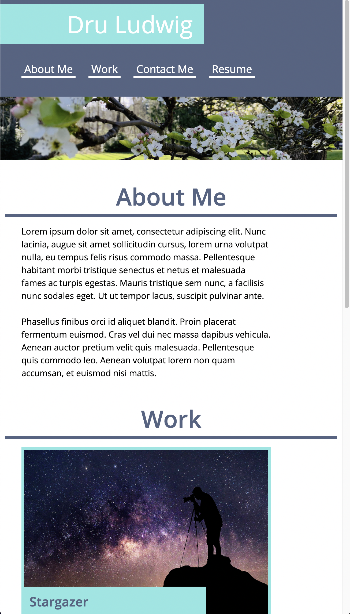
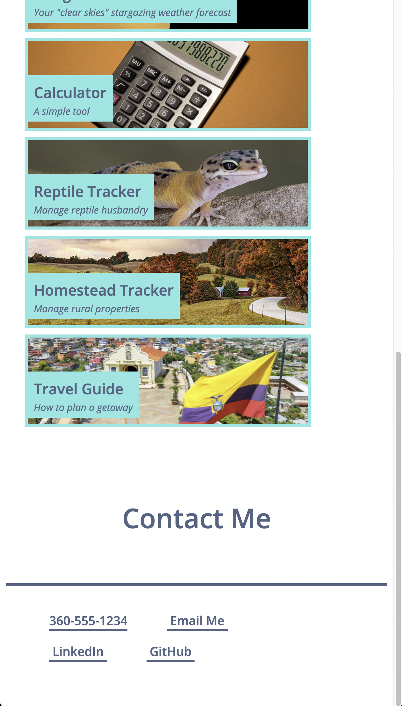

# 02-Advanced-CSS-Portfolio
## The initial layout for my personal portfolio
- My goal is to build a welcoming, accessible, and professional online portfolio.
- I've built out the work/apps section to allow for easy expansion in the future.
- The final draft color scheme is still TBD.
## Learning Outcomes
- Used the CSS @media rule for the first time to significantly adjust the layout when viewed on screen widths of 768px or less.
- Discovered how to style unordered lists into rows.
- Discovered how to use background images in CSS.
- Discovered how to use hover controls in CSS.
- Utilized flexbox containers for the first time.
- Utilized variables for the first time.

## Screenshots
   Desktop Version
    
   Mobile Version
    
    

---
